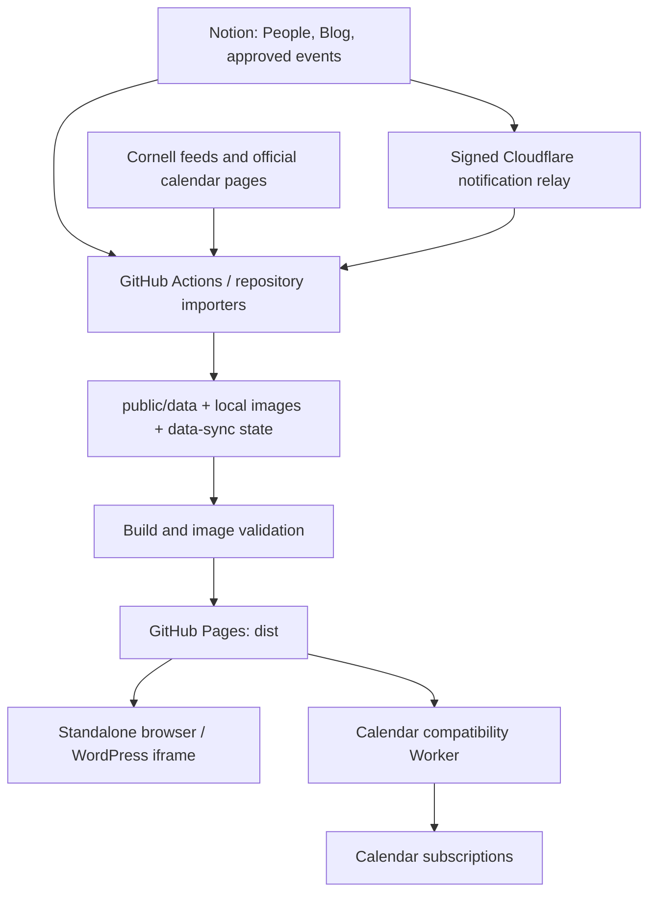

# Cornell Tech Student Government website

This repository contains the CTSG public website, its Notion and Cornell calendar importers, and the infrastructure that publishes saved content. The frontend uses plain HTML, CSS, and JavaScript modules. GitHub Pages serves the built files, and a navigation bridge supports embedding the site fullscreen in Cornell Tech's WordPress site.

Notion is the editing source for People, Blog, and approved student events. GitHub Actions imports public content into this repository; visitors read the saved snapshots and local images without calling Notion. Calendar subscriptions use a small Cloudflare Worker that forwards the published feed.

Configured public URLs:

| Purpose | URL |
| --- | --- |
| Standalone site | [GitHub Pages](https://ct-student-gov.github.io/ctsg-tech-site/public/) |
| WordPress parent | [CTSG](https://ctsg.tech.cornell.edu/) |
| Calendar subscription | [Published ICS feed](https://ctsg-calendar.mh2682.workers.dev/api/calendar.ics) |
| Calendar compatibility API | [Published JSON](https://ctsg-calendar.mh2682.workers.dev/api/calendar) |

## Contents

- [Pages and frontend](#pages-and-frontend)
- [Architecture and repository layout](#architecture-and-repository-layout)
- [Run locally](#run-locally)
- [Commands and verification](#commands-and-verification)
- [Content editing](#content-editing)
- [Calendar sources and history](#calendar-sources-and-history)
- [Repository sync and credentials](#repository-sync-and-credentials)
- [Images and build output](#images-and-build-output)
- [Publication and Cloudflare services](#publication-and-cloudflare-services)
- [WordPress embed and navigation](#wordpress-embed-and-navigation)
- [Troubleshooting and handoff](#troubleshooting-and-handoff)
- [Detailed documentation](#detailed-documentation)

## Pages and frontend

All pages share [public/index.html](public/index.html). Its HTML templates are rendered into the main content area by [public/app.js](public/app.js), using hash routes:

| Navigation | Route | Content |
| --- | --- | --- |
| About | `#/` | CTSG introduction, student-life and representative highlights, a rolling event calendar, and Blog cards. |
| People | `#/members` | Academic-year directories with Executive Board and Representatives groups and expandable biographies. |
| Clubs | `#/clubs` | Plain club directory with descriptions, officers, advisors and joining information, controlled by Notion Publish. See [Clubs setup](docs/clubs.md). |
| Events | `#/events` | Calendar with month, week, and list views; source filters, event dialogs, and subscription/download actions. |
| Governance | `#/by-laws` | Bylaws document embedded from its Google Drive preview. |

Blog posts open in dialogs on the homepage; there is no separate Blog route. The homepage initially shows three posts, with **Show more** revealing the remainder. People years appear newest first, with role ordering defined in `public/app.js`. The calendar displays times in `America/New_York`; narrow screens use the list view on the Events page. The homepage calendar scrolls through days and includes a return-to-today action.

The router updates the document title, active navigation link, and focus when navigating. The frontend also provides a skip link, keyboard-operable dialogs and galleries, and reduced-motion handling. JavaScript is required. Hash routes need no server rewrite rules; unknown valid routes render a page-not-found message.

There is no frontend framework or JavaScript bundler. The main libraries are `ical.js` for ICS parsing and recurrence, `parse5` for HTML parsing and image-reference validation, and Sharp for image conversion. CSS is split between shared styles and page-specific files under `public/styles/`.

## Architecture and repository layout



| Path | Responsibility |
| --- | --- |
| [public/index.html](public/index.html) | Page shell, templates, navigation, static copy, banners, and bylaws embed. |
| [public/app.js](public/app.js) | Routing, People rendering, homepage interactions, and child-side iframe navigation. |
| [public/blog.js](public/blog.js) | Blog cards, article bodies, galleries, descriptions, and credits. |
| [public/calendar.js](public/calendar.js) | Calendar views, filters, event details, subscriptions, and refresh lifecycle. |
| [public/calendar-config.js](public/calendar-config.js) | Browser snapshot endpoint, published preview snapshot, and subscription URL. |
| [public/wordpress-bridge.js](public/wordpress-bridge.js) | Parent-side iframe navigation and browser history synchronization. |
| `public/data/` | Generated public snapshots: `people.js`, `blog.js`, `calendar.json`, and `calendar.ics`. |
| `public/images/` | Original site photos, imported Notion images, vectors, and image source records. |
| [public/demo/](public/demo/) | Local iframe tests, included only in development builds. |
| [people/notion.mjs](people/notion.mjs), [blog/notion.mjs](blog/notion.mjs) | Notion schema checks, publication rules, and content extraction. |
| [calendar/](calendar/) | Feed/HTML/Notion importers, recurrence, deduplication, coverage, history, and Worker handlers. |
| [scripts/](scripts/) | Build, preview, image cache, content sync, repository orchestration, and calendar health commands. |
| [data-sync/](data-sync/README.md) | Committed import state, cached public bodies/photo identities, and permanent calendar history. |
| [sync-webhook/](sync-webhook/) | Signed Notion notification relay and persistent dispatch queue. |
| [.github/workflows/](.github/workflows/) | Validation, scheduled imports, Pages publication, and calendar health checks. |
| [tests/](tests/) | Node tests and upstream HTML/JSON fixtures. |
| [docs/](docs/) | Content authoring, source configuration, deployment history, and service setup. |
| `dist/` | Generated publication artifact; ignored by Git. |

`public/` contains build inputs. `public/data/` and Notion image folders are generated **and committed** so the site can build without source access. `data-sync/` is persistent repository storage, not an Actions cache: deleting calendar state can discard history that no upstream feed still contains. `dist/` is disposable build output.

The first daily run of each UTC month also commits `data-sync/keepalive.txt` using the built-in `GITHUB_TOKEN`. This keeps public-repository schedules active during long periods without content changes or human edits. The keepalive runs before imports, needs no additional secret, and does not itself trigger a build or deployment.

## Run locally

Requires Node.js **20.9.0 or newer** and npm. GitHub Actions uses Node.js 22. Install the lockfile's dependencies and start the preview:

```sh
npm ci
npm run dev
```

- [Standalone site](http://localhost:8081/): child origin on port 8081.
- [Embed demos](http://localhost:8080/demo/): simulated WordPress parent on port 8080.

Both servers bind to `127.0.0.1` and serve `dist/public/`. The different ports deliberately test cross-origin iframe messaging. Both ports must be available.

### What the preview serves

The development server builds at startup and rebuilds on document requests such as a page reload. There is no file watcher or hot reload; reload after editing source or adding photos. A failed rebuild returns an **Image build failed** response instead of showing a successful preview. Embed demos are included locally and excluded by the publication build.

Code, HTML, styles, and available images come from this checkout. **People, Blog, calendar JSON, and calendar ICS normally come from the published site**, falling back to the built local snapshots when published downloads fail. Missing Notion photos can be fetched from published, content-addressed image paths without a local Git update. Normal previews need no Notion credentials and do not modify source snapshots.

Published snapshots share a five-minute server cache across both ports. Document reloads clear it, and snapshot downloads use a fresh query parameter to bypass the static host cache. The preview proxies only supported snapshot and Notion image paths. Local edits to `public/data/` are normally hidden by the published snapshot.

To inspect **local saved data** without that proxy, serve the build with an ordinary static HTTP server. For example, if Python 3 is available and port 8081 is free:

```sh
npm run build
python3 -m http.server 8081 --bind 127.0.0.1 --directory dist/public
```

Open [localhost:8081](http://localhost:8081/) to read this checkout's built snapshots.

### Calendar importer development

```sh
CALENDAR_LOCAL_SOURCES=1 npm run dev
npm run calendar:check -- --url http://localhost:8081/api/calendar
```

Run the second command in another terminal. The flag enables live upstream imports at `/api/calendar` and `/api/calendar.ics`, using environment credentials and in-memory calendar storage/history. It does not save repository snapshots. The website still reads `./data/calendar.json`, so this flag alone does not switch the visible calendar to the local API. Without the flag, the API routes alias the published snapshots with local fallback.

## Commands and verification

| Command | Behavior |
| --- | --- |
| `npm run dev` | Build with demos and serve the two local preview origins. |
| `npm run check` | JavaScript syntax checks for the frontend, importers, scripts, and Workers. |
| `npm test` | Run all `tests/*.test.mjs` with Node's test runner. |
| `npm run people:check` | People syntax checks and focused importer tests. |
| `npm run blog:check` | Blog importer/renderer syntax checks and focused importer tests. |
| `npm run build` | Recreate and validate `dist/public/`; write `dist/index.html` redirect. |
| `npm run images:check` | Validate existing `dist/public/` images and references; does not rebuild. |
| `npm run calendar:check` | Fetch the published calendar JSON and check source state and coverage warnings. |
| `npm run calendar:check -- --url <URL>` | Check a chosen HTTP(S) calendar JSON endpoint. |
| `npm run people:sync` | Import Notion People into saved state, snapshots, and local photos. |
| `npm run blog:sync` | Import Notion Blog into saved state, snapshots, and local images. |
| `npm run calendar:sync` | Import calendar sources and update state plus JSON/ICS. |
| `npm run data:sync` | Reconcile Calendar, People, and enabled Blog through the repository orchestrator. |

Use the full publication checks before publishing site changes, and run build plus image validation after image changes:

```sh
npm run check
npm test
npm run build
npm run images:check
```

Tests cover content filtering, cached biographies/articles/photos, real WebP output, preview fallback, iframe message/history validation, calendar recurrence and New York time, source parsing/pagination, event merging, permanent history, sync failure handling, shared quota cooldown, workflow behavior, and signed notification batching. They use fixtures and mocked requests; they do not establish current live Notion access, upstream completeness, or WordPress script execution.

Sync commands contact upstream services and write repository files. They require credentials; they are separate from ordinary previews and builds. A local combined sync can finish one importer before a later importer fails, so review the resulting diff after a failed run.

## Content editing

| Content | Editing source | Saved website copy |
| --- | --- | --- |
| Site copy, navigation, highlights, banners, bylaws preview URL | `public/index.html`, `public/app.js`, and relevant styles | Built files under `dist/public/` |
| People profiles and biographies | [Notion Team Directory](https://app.notion.com/p/398dc939e9f24b9b8a94f1a32c15d630) | `public/data/people.js` |
| Homepage Blog posts, image descriptions, and credits | [Notion Blog](https://app.notion.com/p/3eb0b1bd6791803780fff4a1b6834210) | `public/data/blog.js` |
| Approved Club, Community, and CTSG events | Three databases under [Notion Events](https://app.notion.com/p/3eb0b1bd67918044910ccfc7b84c5785) | `public/data/calendar.json` and `.ics` |
| Official department/public/academic events | Upstream Cornell feeds and calendar pages | Same calendar snapshots |

Edit imported content at its source. Hand edits to generated snapshots can be overwritten on the next sync. Keep implementation changes within the requested scope; [AGENTS.md](AGENTS.md) records the repository's working preferences, including plain HTML for new pages unless styling is explicitly requested.

### People

Only profiles with **Publish** checked and not archived/trashed are eligible. Each needs **Name**, **Role**, **Section**, **Academic Year**, and exactly one **Photo**. Section must be `Executive Board` or `Representatives`. Academic Year accepts consecutive-year labels such as `2026–27` or `2026–2027`; a record can belong to several years. Program, Graduation Year, and biography are optional.

Role and Section support multi-select and are paired in saved selection order: Role 1 → Section 1, Role 2 → Section 2. Select the same number in each field. Each pair produces one card per selected academic year; mismatches preserve the last valid profile with a warning. Single-select fields remain supported. See [People authoring](docs/people.md) for an example and legacy fallback behavior.

Biographies come from plain paragraphs after a level-one/two heading exactly **Website Bio**, stopping at the next such heading or embedded child document/database. Lists and nested blocks inside that section are invalid. Optional **Email** and **Links** fields supply the expanded profile's contact footer; Links is one Text property with up to four full URLs on separate lines. Site favicons are cached locally across profiles and syncs. Other page content and private fields such as Person and Work Items are excluded. Separate records can preserve different roles and biographies across academic years.

Successful syncs remove unchecked, deleted, or archived profiles. An incomplete new profile is skipped with a field warning; an invalid existing profile keeps its last published version while valid profiles update. API, schema, pagination, and photo-download failures abort the importer. The People banner is preserved from the existing local snapshot rather than imported from profile records. See [People documentation](docs/people.md).

### Blog

Posts need **Publish** checked, **Name**, and a valid **Date**. They sort newest first. **Images** accepts any number of files, including zero; the first image appears on the card and all images appear in the article gallery.

**Image Alt Text** requires one nonempty description per image, in Images order. It supplies both accessibility text and visible gallery descriptions. **Image Credits** may be empty or contain one line per image, with blank lines for uncredited images. Descriptions and credits are maintained in Notion.

The page body supplies the article: paragraphs, headings, flat lists, quotes, code, and dividers are supported, along with inline formatting and HTTP/HTTPS/email links. Put photos in the Images property. Embedded child pages/databases are excluded; unsupported or nested text blocks invalidate the post.

Incomplete new posts are skipped; invalid edits retain the last published post with a warning. Unchecking Publish, deletion, or archiving removes a post after successful sync. See [Blog documentation](docs/blog.md).

## Calendar sources and history

| Source | Publication rules |
| --- | --- |
| CampusGroups Student Affairs, Inclusion & Belonging, Career Management | Official department feeds, supplemented by configured student exports; eligible cohosted/program events are included. Private, prospective-only, cancelled, and postponed events are excluded. |
| Cornell Tech public events | Public/student listings with full dates verified from official detail pages or supported organizer metadata. Unverifiable dates are withheld with warnings. |
| Notion Clubs, Community, CTSG | `Approval status` must be exactly `Published`, with a title/date; cancelled, archived, trashed, and unpublished records are excluded. The database determines the category. |
| Cornell Registrar | Relevant Fall/Spring instruction, holidays, breaks, study/exam windows, course deadlines, and graduate/professional/Tech enrollment openings. |
| Cornell Tech academic calendar | Supplemental Maker Days and new-admit pre-enrollment dates. |

Notion events use **Event Title**, **Date**, **Description**, **Registration Form Link**, and **Club Name** / **Organization Name**, with optional Location and Event status. Images and internal Notion properties are excluded. Student exports publish reduced public information and canonical registration links; personalized export URLs, private notes, descriptions, and locations do not enter snapshots. Matching public records can supply public detail.

Recurring ICS events and exceptions expand within a **90-day-back / 400-day-ahead** import window. Times use New York time, including daylight saving; all-day end dates remain exclusive. Deduplication uses stable identities and recognized event/registration URLs plus start time. Titles alone do not merge events, and merged records retain membership in each contributing source filter.

Ended events persist in the repository archive and JSON/ICS after disappearing upstream. Historical Notion edits and explicit page notifications can correct or withdraw archived records. Routine queries do not individually poll every old page; a missed historical deletion notification can leave an archived record in place. Keep `data-sync/calendar.json` across academic years.

Coverage checks flag a newly empty source or a drop of at least five events and half the previous count over a comparable horizon. Warnings are logged during sync and checked by the health workflow; they do not themselves block repository publication. Counts cannot reveal every event missing from an upstream export. Calendar snapshot timestamps stay unchanged on no-op imports, so **successful sync workflow runs**, rather than snapshot age, establish recent reconciliation. See [Calendar documentation](docs/calendar.md) for source IDs, authoring details, and coverage limitations.

## Repository sync and credentials

The orchestrator is [scripts/sync-repository.mjs](scripts/sync-repository.mjs). Full runs import Calendar, People, and Blog when Blog is configured or already has saved state. Notifications refresh only affected domains; calendar notifications preserve cached Cornell feeds and reconcile the Notion event tables. A missing initial calendar cache requires a full source import.

People and Blog metadata queries detect changes while reusing unchanged bodies and photos. Calendar stores per-source live records, permanent history, and Notion query cursors before deduplication. Notification page IDs are hints that force relevant reconciliation, including historical corrections. Photo downloads depend on a changed attachment URL after removing query/hash, or a missing/corrupt local file. Rotating signed URLs do not force downloads; replacing an external image's bytes at the same stable URL leaves the cached copy in use.

### Environment configuration

Provide credentials through the process environment locally and repository **Actions secrets** in CI. The scripts do **not** automatically load `.env` or `.dev.vars`, and the standalone import commands do not expose extra CLI flags. Optional source overrides below are process environment variables; the checked-in workflow uses the source defaults.

| Variable | Purpose |
| --- | --- |
| `NOTION_TOKEN` | Read-only Calendar connection for the three Notion event sources. |
| `NOTION_PEOPLE_TOKEN` | Read-only Team Directory connection. |
| `NOTION_BLOG_TOKEN` | Read-only Blog connection. |
| `CAMPUSGROUPS_STUDENT_AFFAIRS_URL` | Account-specific Student Affairs student export. |
| `CAMPUSGROUPS_CAREER_MANAGEMENT_URL` | Account-specific Career Management student export. |
| `CAMPUSGROUPS_INCLUSION_BELONGING_URL` | Optional Inclusion & Belonging student export. |
| `NOTION_DATA_SOURCE_ID` | Override the Clubs event data source. |
| `NOTION_COMMUNITY_DATA_SOURCE_ID` | Override the Community event data source. |
| `NOTION_CTSG_DATA_SOURCE_ID` | Override the CTSG event data source. |
| `NOTION_PEOPLE_DATA_SOURCE_ID` | Override Team Directory. |
| `NOTION_BLOG_DATA_SOURCE_ID` | Override Blog. |

`data:sync` requires the Calendar token and both Student Affairs/Career export URLs whenever Calendar is selected, including notification runs. People requires its token. Blog joins full imports when its token **or existing state** is present; removing an established Blog token fails the sync rather than silently dropping Blog. Existing connected calendar sources likewise cannot silently lose credentials.

Never commit tokens, account-specific subscription URLs, private properties, or expiring Notion image URLs. `.gitignore` excludes `.env`, `.env.*`, `.dev.vars*`, and `.wrangler/`, but those exclusions do not load configuration. Saved state and Git history are public content storage; withdrawing a profile or post from the current site does not erase earlier Git revisions.

### Failure and no-op behavior

Unchanged public data keeps the same snapshots and skips site rebuilding. State-only updates may produce a small bot commit without publication. Importers do not immediately retry failed Notion requests. An HTTP 429 creates `data-sync/backoff.json` with a shared deadline at the next UTC midnight; subsequent orchestrated syncs defer all domains until that deadline. A successful later run removes the marker. Standalone importer commands do not manage that shared cooldown.

In CI, failed imports or builds leave the deployed site intact. Rate-limit handling commits only the cooldown marker, excluding partially prepared content. Other failures wait for a later notification, scheduled run, or manual retry. Concurrent human changes can cause a non-fast-forward bot push to fail safely before deployment. See [Repository sync documentation](docs/repository-sync.md) for recovery and activation details.

## Images and build output

Put original photos under `public/images/`, using year subfolders where useful. Reference them with **literal local paths** in HTML, CSS, or snapshot data, for example `./images/members/2030/jane-doe.jpg` from the page. JavaScript image paths are interpreted relative to the page, not the module directory. CSS paths are relative to the stylesheet, so files in `public/styles/` normally use `../images/...`. Dynamically assembled paths cannot receive the build's reference rewriting. Download displayed raster photos locally; keep external URLs as source citations. SVGs remain vectors, and existing HTTP(S) vector logos may remain external.

[scripts/build.mjs](scripts/build.mjs) recreates `dist/public/` from `public/`:

- Raster photos become WebP at quality 82, fit within **2048 × 2048** without enlargement, and receive EXIF orientation correction. Newly encoded files have metadata stripped; existing appropriately sized WebP files are copied byte-for-byte.
- Literal references in HTML, CSS, JavaScript, and JSON are rewritten to the built image paths, including `srcset` and social preview images. Original source files remain intact.
- Identical encoded photos share one published file across folders, including images used by banners and Notion posts. References follow the retained file.
- Embed demos are excluded, and `dist/index.html` redirects to `./public/` to preserve existing hosted URLs.

Build validation rejects broken local paths, invalid/disguised/oversized images, external rendered raster photos, rendered data-image URLs, unconverted raster output, `.ico` favicons, and symbolic links. Case-insensitive output collisions fail: `jane-doe.jpg` and `jane-doe.webp` in the same folder cannot both map to one filename.

Notion importers save raster copies under `public/images/members/notion/<year>/` or `public/images/blog/notion/<year>/`, with page IDs and content hashes in filenames. Blog also preserves SVGs. Cached identical images can reuse a file from another year or collection. [scripts/image-cache.mjs](scripts/image-cache.mjs) verifies those hashes before reuse. Website conversion does not modify the original Notion upload.

Run **both** `npm run build` and `npm run images:check` after image changes. The latter validates existing output and cannot replace a build. Do not hand-edit or commit `dist/`, or publish raw `public/` assets; publication uses the validated `dist/` artifact.

## Publication and Cloudflare services

### GitHub Pages workflow

[Build and publish site](.github/workflows/pages.yml) validates pull requests and main pushes, runs daily at **00:43 UTC**, accepts manual runs, and handles `notion-updated` repository dispatches. Main scheduled/notification/manual runs with **sync** enabled refresh saved content. Ordinary pushes and pull requests validate the saved data without importing sources. Missing initial Calendar/People state, or enabled Blog state, forces a complete import before main publication.

The workflow serializes jobs and checks out current main for queued main builds. It runs syntax checks and tests, syncs when requested, then builds and image-validates changed public content before committing imported data and publishing that same artifact. A no-op sync skips publication. Bot commits do not rely on triggering a second workflow; deployment happens in the original run. Pull requests validate without deploying.

The first daily run of each UTC month also commits `data-sync/keepalive.txt` using the built-in `GITHUB_TOKEN`. This keeps public-repository schedules active during long periods without content changes or human edits. The keepalive runs before imports, needs no additional secret, and does not itself trigger a build or deployment.

GitHub Pages must use **GitHub Actions** as its deployment source. Actions also needs permission to write imported data to the repository; branch rules must accommodate the chosen bot workflow. The uploaded artifact is `dist/`, retaining the `/public/` path. [Check calendar coverage](.github/workflows/calendar-health.yml) separately runs at minute 23 every six hours and accepts manual checks. It checks saved source states/warnings, not all upstream events or the success of the latest sync.

### Calendar compatibility Worker

[calendar/wrangler.jsonc](calendar/wrangler.jsonc) selects [calendar/static-worker.mjs](calendar/static-worker.mjs). It serves `/api/calendar` and `/api/calendar.ics` by forwarding GitHub Pages snapshots with a five-minute cache. It does not import sources or run a refresh cron. Calendar apps choose their own subscription refresh intervals; a downloaded `.ics` is a one-time copy.

The configuration retains the existing KV and Durable Object bindings, and exports the old processor class for migration compatibility. Public static routes do not invoke it. `calendar/worker.mjs` contains the earlier live-import handler; its presence does not make it the configured production entrypoint. Preserve retained storage resources during ordinary maintenance.

If hosting changes, review `CALENDAR_SNAPSHOT_BASE_URL` in the Worker configuration, `public/calendar-config.js`, the image-resolution `siteBase` in `scripts/build.mjs`, absolute image metadata URLs in `public/index.html`, and WordPress embed URLs. Preserve the subscription domain where possible so existing subscribers keep receiving updates.

### Signed Notion notification relay

[sync-webhook/worker.mjs](sync-webhook/worker.mjs) accepts `/notion/calendar`, `/notion/people`, and `/notion/blog`. Each route validates an HMAC-SHA256 signature over the original request bytes using its own verification secret. It forwards limited event/source/page hints, not profiles, articles, photos, or Notion API credentials.

The checked-in implementation uses one SQLite-backed `NotionSyncQueue` Durable Object for all three connections. The first notification starts a five-minute batch; later edits join without extending its deadline. Page IDs are deduplicated, mixed batches identify all affected domains, and failed GitHub dispatches retain the batch for a five-minute retry. Daily/manual syncs remain independent. An accepted notification acknowledges queueing, not a completed website update.

Worker secrets are `GITHUB_DISPATCH_TOKEN`, `NOTION_CALENDAR_WEBHOOK_SECRET`, `NOTION_PEOPLE_WEBHOOK_SECRET`, and `NOTION_BLOG_WEBHOOK_SECRET`. The GitHub token is restricted to this repository with Contents read/write for dispatch. Keep secrets out of Wrangler `vars` and committed files. Detailed verification, subscription events, credentials, and token-expiry records are in [Notion notifications](docs/notion-webhook.md).

**Site publication does not deploy either Worker.** Cloudflare deployments and Notion subscription setup are separate operations. The webhook documentation records a pre-batching live relay while batching is prepared locally; checked-in queue code alone does not establish that it has been deployed. Treat dated activation notes as operational history and verify service status when making an infrastructure change.

## WordPress embed and navigation

Use the hosted site URL, iframe ID `ctsg-site`, and the bridge loaded after the iframe:

```html
<iframe
  id="ctsg-site"
  title="Cornell Tech Student Government"
  src="https://ct-student-gov.github.io/ctsg-tech-site/public/"
  style="position:fixed;inset:0;width:100%;height:100%;border:0;background:white;z-index:99999;"
></iframe>
<script src="https://ct-student-gov.github.io/ctsg-tech-site/public/wordpress-bridge.js" defer></script>
```

The bridge must execute once in the **WordPress parent document**. It synchronizes parent deep links such as `#/members`, child clicks, reloads, and Back/Forward. In bridge mode the parent owns history; the child replaces its own hash rather than adding a duplicate entry. Without the bridge, navigation works inside the iframe but cannot read or update the cross-origin parent URL.

Both sides validate the message channel, sending window, origin, and route. The child accepts only `https://ctsg.tech.cornell.edu`, `http://localhost:8080`, and `http://127.0.0.1:8080`, as listed in `allowedParents` in `public/app.js`. The parent derives the child origin from the iframe URL. A new parent domain or preview port requires updating the allowlist intentionally.

The static host's framing headers and the parent's content security policy must permit the iframe and bridge. A sandboxed iframe needs `allow-scripts` and `allow-same-origin`. Verify the saved, published WordPress page; editor previews cannot establish whether the script survives publication. An optional element with ID `ctsg-bridge-status` displays script/iframe/navigation diagnostics.

Use [the synchronized local demo](http://localhost:8080/demo/synced.html#/members) to test parent deep links, child navigation, reloads, and Back/Forward. [The iframe-only demo](http://localhost:8080/demo/iframe-only.html) checks behavior without a bridge. [tests/bridge.test.mjs](tests/bridge.test.mjs) covers message validation and history behavior; actual WordPress framing and script execution require browser verification.

## Troubleshooting and handoff

| Symptom | Check |
| --- | --- |
| Local snapshot edits do not appear | `npm run dev` prefers published data. Use a static server over the build to inspect local snapshots. |
| Local preview shows an image build error | Check the reported missing path, invalid image, or filename collision; fix the source and reload. |
| Preview cannot start | Free both ports 8080 and 8081. |
| Notion edit does not appear | Check Publish/approval and field warnings, then the relevant sync Action. Relay delivery, batching, job queueing, and publication each add time. |
| Invalid edit leaves old content visible | Existing invalid People/Blog records retain their last published version. Correct the warning's fields/body structure or withdraw publication. |
| Sync reports missing credentials despite an `.env` file | Export them into the process environment; scripts do not load that file automatically. |
| Sync says it is deferred | Check `data-sync/backoff.json`; orchestrated imports wait until its UTC deadline after a Notion 429. |
| Calendar timestamp looks old | No-op imports preserve it. Check the latest successful sync workflow rather than inferring failure from snapshot age. |
| An expected event is missing | Verify upstream feed coverage, approval/audience rules, and date-verification warnings. A passing health check cannot prove completeness. |
| Parent URL does not change | Verify the published parent retained the bridge, the iframe ID matches, and its origin is allowed. Use the diagnostic element or synchronized demo. |
| Worker behavior differs from local code | Check its configured entrypoint and deployment separately from GitHub Pages. |

During officer handoff, preserve `data-sync/` and verify access to the repository/Actions secrets, read-only Notion connections, CampusGroups export accounts, Cloudflare Workers/domain, webhook credentials/expiry, and WordPress parent. Replace account-specific export URLs when access changes. Check scheduled Actions after long periods without repository activity, and verify a successful reconciliation before assuming updates are running.

## Detailed documentation

- [People](docs/people.md): Team Directory authoring and profile import behavior.
- [Blog](docs/blog.md): posts, supported article blocks, image descriptions/credits, and connection history.
- [Calendar](docs/calendar.md): exact sources, Notion fields/IDs, subscriptions, coverage limitations, and Worker maintenance.
- [Repository sync](docs/repository-sync.md): credentials, activation/recovery order, archives, and quota behavior.
- [Notion notifications](docs/notion-webhook.md): verification, signed delivery, batching setup, deployment notes, and credential expiry.
- [Saved data](data-sync/README.md): committed state files and what must survive across academic years.
- [Working preferences](AGENTS.md): scope, plain-HTML page additions, and required image checks.
